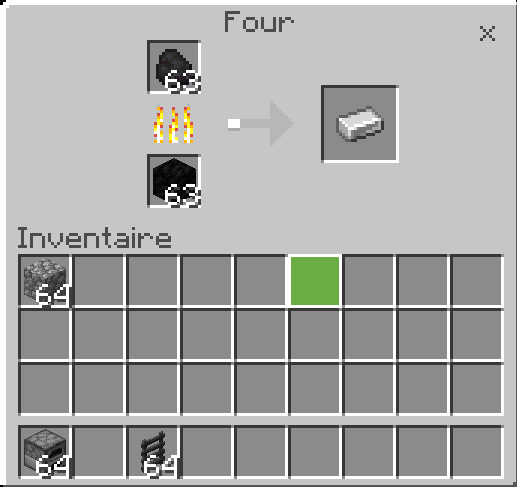

## CustomFurnaceRecipes 

<p>This plugin allows you to save several new recipes for your oven. imagine a countless number of cooking possibilities for all your items!!</p>
<p>For the moment, nothing has been done to delete an already existing recipe. Please wait a few days until a solution is found.</p>

### config
```yaml
recipes:
  0:
    input: "minecraft:coal"
    output: "minecraft:iron_ingot"
  1:
    input: "minecraft:cobblestone"
    output: "minecraft:coal"
```

### images

<center>

</center>